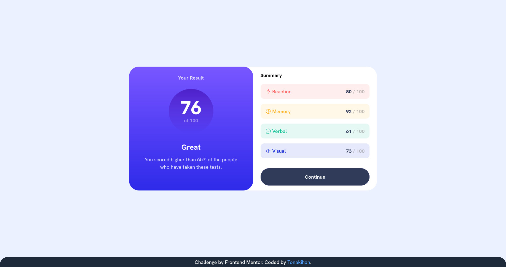
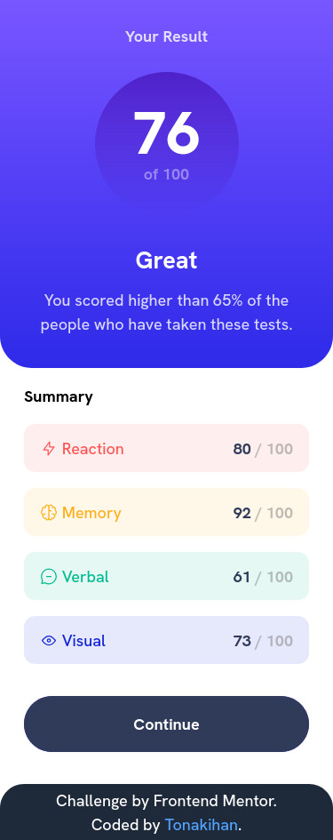

# Results summary component

This is a solution to the [Results summary component challenge on Frontend Mentor](https://www.frontendmentor.io/challenges/results-summary-component-CE_K6s0maV). Frontend Mentor challenges help you improve your coding skills by building realistic projects.

## Table of contents

- [Overview](#overview)
  - [The challenge](#the-challenge)
  - [Screenshot](#screenshot)
  - [Links](#links)
- [My process](#my-process)
  - [Built with](#built-with)
  - [What I learned](#what-i-learned)
  - [Useful resources](#useful-resources)
- [Author](#author)

## Overview

### The challenge

Users should be able to:

- View the optimal layout for the interface depending on their device's screen size
- See hover and focus states for all interactive elements on the page
- **Bonus**: Use the local JSON data to dynamically populate the content

### Screenshot
<p align="center">
 
</p>

### Links

- Solution URL: [Add solution URL here](https://your-solution-url.com)
- Live Site URL: [site](https://tonakihan.github.io/test-results-summary-component/)

## My process

### Built with

- Semantic HTML5 markup
- CSS custom properties
- Flexbox
- CSS Grid
- [Tailwind CSS](https://tailwindcss.com/)
- [SASS](https://sass-lang.com/)

### What I learned

The CSS transition property hasn't worked with linear-gradient.

```css
.element {
  background-image: linear-gradient(#000, #FFF);

  /* Below property will be ignored by browser. */
  transition-duration: 300ms;
  transition-delay: 150ms;
  transition: all;
}

.element:hover {
  background-color: teal;
}
```

I also think that Tailwind CSS is a cool tool, but it's not very suitable for production. After building the page, it may be hard to change the style later.

### Useful resources

- [Tailwind CSS Docks](https://tailwindcss.com/docs)
- [MDN](https://developer.mozilla.org/en-US/docs/Web/CSS/Reference)
- [W3School](https://www.w3schools.com/csS/default.asp)


## Author

- Website - [Mark](https://github.com/tonakihan)
- Frontend Mentor - [@tonakihan](https://www.frontendmentor.io/profile/tonakihan)
